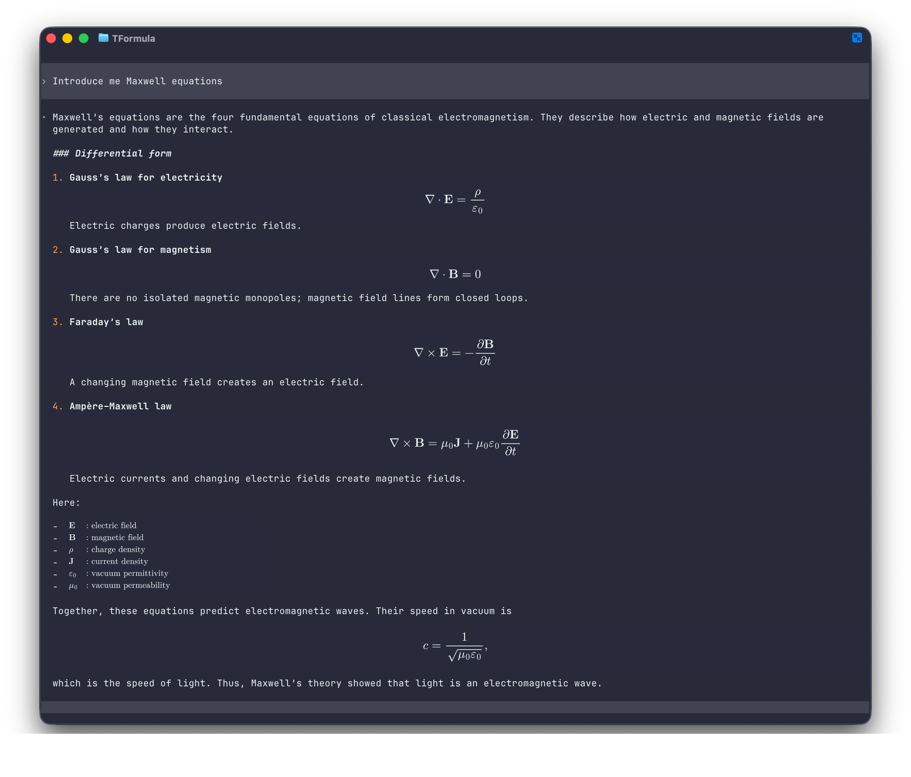

# TFormula

[English](README.md) | [简体中文](README.zh-CN.md)

Render LaTeX from **any CLI agent**, or read Markdown and images directly
inside your terminal.

> **Ghostty is the recommended terminal.** TFormula is developed and tested
> primarily with Ghostty and also works with terminals that implement the Kitty
> graphics protocol, including Kitty and WezTerm.

TFormula is a terminal-agnostic PTY proxy. It does not use Codex, Claude,
Gemini, or any other agent-specific API.

The child program still sees a normal terminal. TFormula forwards its ANSI
output unchanged, maintains a headless copy of the terminal screen, detects
visible TeX, renders it locally with MathJax, and places the result over the
source text using the Kitty graphics protocol. The original text remains in
the terminal buffer for copying.

## See it in action

This example shows a CLI agent explaining Maxwell's equations in Ghostty.
TFormula detects the LaTeX in the live terminal output and renders the equations
in place without replacing the surrounding text.



## Markdown reader

Pass a Markdown, text, or image path instead of a command to open TFormula's
full-screen document reader:

```sh
tformula README.md
tformula notes.txt
tformula assets/tformula-maxwell.png
```

Known document extensions are detected automatically. Use `--read` to open
another UTF-8 text file without making it ambiguous with a command:

```sh
tformula --read package.json
```

The reader parses Markdown into a document tree and lays it out again for the
current terminal width. Markdown markers are hidden: headings, emphasis,
quotes, nested lists, task items, fenced code, GFM tables, links, inline math,
display math, and local images are displayed as document elements. Local
PNG, JPEG, WebP, GIF, AVIF, TIFF, HEIF, and SVG files are converted to a
terminal-ready PNG and keep their aspect ratio.

The reader recognizes `$...$`, `$$...$$`, `\(...\)`, and `\[...\]` math
delimiters, including a `$$...$$` display equation written on one line. It also
recovers standalone `[ ... ]` blocks when their contents contain unambiguous
TeX such as `\sum`, `\frac`, or structured subscripts, without treating normal
Markdown brackets as formulas.

Useful reader keys:

| Key | Action |
|---|---|
| `j` / `k`, arrows | Scroll one line |
| `Space` / `b`, Page Down / Up | Scroll one page |
| `g` / `G` | Go to the start / end |
| `/`, `n` / `N` | Search, then find next / previous |
| `t` | Open the table of contents |
| `[` / `]` | Go to the previous / next heading |
| `+` / `-` | Zoom document images in / out |
| `0` | Reset images to automatic fit |
| `Tab` / `Shift-Tab`, `Enter` | Select and open a link |
| `h` / Left | Return to the previous local document |
| `r` | Toggle rendered and Markdown source views |
| `q` | Quit |

Relative Markdown links and `#heading` fragments open inside the reader.
HTTP links are identified but are not launched automatically. Remote and data
images are likewise not fetched in this first release. On a terminal without
Kitty graphics, all text formatting remains available; formulas fall back to
TeX and images to labeled placeholders.

At 100%, each local image is automatically fitted to the document width and
the current viewport while preserving its aspect ratio. Zoom is relative to
that fitted size. A magnified image may span several screens; scrolling shows
the corresponding image slice instead of hiding the image until it fits
entirely in the viewport.

Reader startup probes the terminal while loading the document in parallel.
Markdown text is committed before uncached graphics, formulas are measured and
rasterized only when they enter the viewport, and rapid key input is coalesced
to the newest frame. An image is normalized and uploaded once; zooming and
cross-screen scrolling reuse that terminal image with source rectangles.

## Quick start in Ghostty

Recommended global installation. With npm 11, allow the native setup scripts
used by `node-pty` and the reader's `sharp` image pipeline:

```sh
npm install -g tformula --allow-scripts=node-pty --allow-scripts=sharp
```

Then place `tformula` before whichever agent command you already use:

| Agent | Command |
|---|---|
| OpenAI Codex | `tformula codex` |
| Claude Code | `tformula claude` |
| Cursor Agent | `tformula agent` |
| Pi coding agent | `tformula pi` |
| Gemini CLI | `tformula gemini` |
| OpenCode | `tformula opencode` |
| Aider | `tformula aider` |
| Goose | `tformula goose` |
| Qwen Code | `tformula qwen` |
| Any other CLI agent | `tformula -- <agent-command> [args...]` |

The agent itself must already be installed and available on your `PATH`.
TFormula simply wraps the command; it has no agent-specific integration.

For example, start different agents with:

```sh
tformula codex
tformula claude
tformula agent
tformula gemini
tformula opencode
tformula aider
```

`--shell` starts an enhanced login shell, so commands launched inside that shell
can be wrapped without creating an alias for each agent:

```sh
tformula --shell
```

Running `tformula` without arguments is equivalent to `tformula --shell`.

## Requirements

- Ghostty recommended; Kitty, WezTerm, or another Kitty-graphics terminal
- macOS or Linux
- Node.js 20 or newer
- The CLI agent you want to run

The current implementation has been developed against Ghostty 1.3.1.

## Install from this checkout

```sh
npm install
npm run check
npm link
tformula codex
```

## Formula sizing

At startup and after terminal resize events, TFormula queries the terminal for
its cell dimensions in pixels. MathJax's natural `ex` dimensions are mapped to
the terminal cell height, so an ordinary mathematical symbol has approximately
the same visual size as neighboring terminal text. Fractions, sums, and other
tall constructs retain their natural proportions.

Formulas are never enlarged merely to fill the source rectangle. They are only
scaled down when they would exceed the columns or rows already occupied by the
source. This is necessary because inserting terminal rows behind a full-screen
TUI would desynchronize its cursor coordinates.

Formula scans are coalesced during streaming output instead of waiting for the
terminal to become completely idle. Unrelated status-bar or spinner updates do
not cancel formulas that remain unchanged on screen. Long PTY output bursts are
forwarded at line-boundary checkpoints of roughly one third of the terminal
height. TFormula completes a formula scan at each checkpoint before forwarding
more rows, so rendered images enter scrollback together with their source text
instead of being missed after an entire response scrolls past. When the terminal
grid or cell pixel size changes, TFormula replaces only the affected Kitty
placements.
The underlying PNG is retained and shared by every placement with the same
formula, size, and colors. Normal resizing only replaces images still in the
live viewport; off-screen placements are preserved so the terminal can scroll
and scale them with its own scrollback. Replacement is transactional: the old
placement is deleted only after the new cached variant is ready, and xterm
markers track its source rows through terminal reflow. A rapid sequence of font
size changes therefore keeps the previous rendered formula instead of exposing
the underlying TeX. `CSI 2J` invalidates visible placements,
while `CSI 3J` and `RIS` invalidate all placements and cached terminal images.
TFormula reserves a private image-ID range and deletes that complete range on
full reset and shutdown, including interrupted transmissions.

When an agent emits display math as a single standalone `$$...$$` or
`\[...\]` line, TFormula borrows adjacent blank terminal rows when available.
This gives fractions and derivatives enough vertical space to retain the same
base glyph size as simple equations. Inline math and display delimiters mixed
with prose are never expanded, so neighboring text is not covered.

A trailing inline formula can similarly use one following blank row for tall
fraction content. TFormula absorbs terminal punctuation into that overlay so it
stays next to the rendered expression. Valid TeX is passed to MathJax without
algebraic rewrites, so forms such as `1/\sqrt{...}`, superscripts, and unit
slashes retain exactly the semantics emitted by the child program.

When TeX soft-wraps at the terminal edge, or a terminal TUI inserts hard rows at
its own content width, TFormula reassembles the expression and paints it through
transparent per-row slices. Text sharing the first or last physical row remains
visible. Inline glyphs are left-aligned with the source span so they stay next
to preceding prose. Standalone display equations use the full terminal width;
embedded display equations are centered inside the safe geometric interval
between their prefix and suffix, so equations with different TeX source lengths
share one center line. For inline content, the layout layer generically composes
formula tokens and literal-text tokens from the first formula to the line end.
It does not interpret the surrounding language. This moves otherwise
unavoidable source-width padding to the harmless end of the line while the
original terminal cells remain intact for copying and TUI cursor correctness.

If a terminal does not answer pixel-size queries, TFormula falls back to 9x18
pixels. You can override that explicitly:

```sh
tformula --cell-size 10x20 claude
```

The default text-relative scale is 1.0. It can be adjusted without changing the
terminal font:

```sh
tformula --scale 1.1 codex
TFORMULA_SCALE=0.9 tformula --shell
```

## Formula and reader image cache

Math rendering is content-addressed and shared by every TFormula-wrapped Agent
run for the current user. A normalized formula is typeset to SVG once. Each
terminal-ready PNG variant is then rasterized once for its exact display mode,
cell dimensions, scale, foreground, background, and source rectangle. Returning
to an earlier terminal font size reuses the existing PNG instead of invoking
MathJax or the rasterizer again.

Local reader images use the same bounded persistent cache. The cache key
includes the source path, size, modification time, orientation-aware
dimensions, and quantized terminal resolution. Reopening a document therefore
reuses its terminal-ready PNG, while changing the source automatically selects
a new entry. Reader-side terminal images also use an LRU budget so navigating
through many documents does not grow terminal image storage without bound.

Cache writes use per-item cross-process locks and atomic renames, so concurrent
Agents can safely request the same formula. In a live terminal session, one PNG
is uploaded once and reused by independent Kitty placements wherever the same
variant appears. The original TeX text remains in terminal scrollback.

On macOS the disk cache defaults to `~/Library/Caches/TFormula`; on Linux it
uses `$XDG_CACHE_HOME/tformula` or `~/.cache/tformula`. Override the location or
the default 256 MB limit with:

```sh
TFORMULA_CACHE_DIR=/path/to/cache tformula codex
TFORMULA_CACHE_MAX_MB=512 tformula claude
TFORMULA_READER_MAX_IMAGES=128 tformula README.md
```

## Detection

TFormula recognizes these explicit forms:

```text
\[ ... \]
$$ ... $$
\( ... \)
$ ... $
\begin{equation} ... \end{equation}
\begin{align} ... \end{align}
```

The standard equation, alignment, gather, cases, and matrix environments are
recognized with or without surrounding dollar delimiters.

Some agent TUIs consume the backslashes around `\[` and `\]` while rendering
Markdown. For that case TFormula conservatively recognizes a bare `[`/`]`
block only when its body contains strong TeX features such as `\frac`, `\sum`,
subscripts, superscripts, or braced arguments.

The same compatibility rule applies when a TUI turns inline delimiters such as
`\(\rho\)` into `(\rho)`. TFormula renders the parenthesized span only when its
contents contain a recognized TeX command or similarly strong math structure;
ordinary prose in parentheses remains unchanged.

Short equations such as `E=mc^2`, `p=0`, and `c^2` are also recognized from
their operator structure. A single letter is inferred only in a symbol
definition item, where forms such as `- (E)：energy` are unambiguous.

Consecutive definition items such as `- (\rho)：电荷密度` are rendered as one
compact two-column MathJax array. This keeps symbols, colons, and descriptions
aligned even though their original TeX source strings have different widths.
Math expressions embedded in a description, including units written with
`\text{...}`, remain mathematical content inside that array.

Single-dollar expressions also require mathematical structure, which prevents
ordinary prices such as `$12.50` from being rendered.

## Options

```text
--shell                 Start the login shell
--read <path>           Open a Markdown, text, or image file
--no-math               Run only as a transparent PTY proxy
--scale <number>        Formula-to-terminal text scale (0.5 to 2.0)
--cell-size <WxH>       Override terminal cell pixels
-C, --cwd <directory>  Child working directory
--debug                 Print detection and sizing diagnostics
```

Use `--` when an agent command or its arguments could be mistaken for TFormula
options:

```sh
tformula -- claude --resume
```

## Safety and fallback behavior

- MathJax and fonts are installed locally; rendering does not use a CDN.
- Formula length is limited to 8192 characters.
- Commands that can load or embed external content, including `\require`,
  `\href`, `\url`, and MathJax HTML/style commands, are rejected.
- A parse or render failure leaves the original LaTeX visible.
- On terminals without Kitty graphics support, TFormula remains a transparent
  PTY proxy. The document reader retains its ANSI text layout and uses readable
  formula and image placeholders.
- Reader HTML is treated as text; it is not executed. Reader images are loaded
  only from local files in this release.

## Development

```sh
npm run build
npm test
npm run check
```

The test suite covers delimiter inference, false-positive filtering, Unicode
column positions, terminal response parsing, text-relative geometry, Kitty
encoding, MathJax-to-PNG rendering, Markdown parsing and layout, and generic
command wrapping.

For an end-to-end diagnostic, add `--debug`. A successful render reports the
terminal cell size, source location, and generated pixel rectangle without
printing the formula image bytes.
