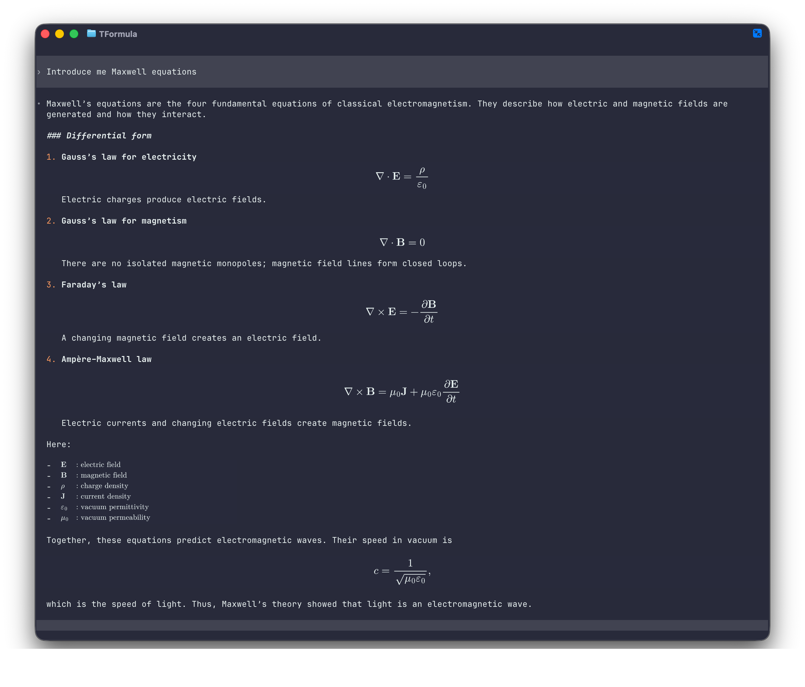

# TFormula

[English](README.md) | [简体中文](README.zh-CN.md)

直接在终端中渲染 **OpenAI Codex** 以及其他 CLI Agent 实时输出的科学公式，
同时保持终端原有的完整交互能力。

TFormula 最核心的用法就是：

```sh
tformula codex
```

Codex 仍然是原来的 Codex CLI，但回答中的公式会在终端中原位渲染，不再停留为
原始 TeX。Markdown、文本和图片阅读器是用于打开本地文档的附加模式。

每个成功渲染的公式也会立即变成可复用内容，不需要重新选择或输入：

```sh
tformula copy mathml       # 最近公式 -> 剪贴板
tformula save formula.png  # 最近公式 -> 高清图片
```

> **推荐在 Ghostty 中使用。** TFormula 主要基于 Ghostty 开发和测试，也支持
> Kitty、WezTerm 等实现了 Kitty Graphics Protocol 的终端。

TFormula 是一个与 Agent 无关的 PTY 代理。它不调用 Codex、Claude、Gemini
或其他 Agent 的专用 API，因此只要 Agent 能在终端中运行，就可以尝试使用
TFormula 包装。

Agent 看到的仍然是普通终端。TFormula 原样转发 ANSI 输出，同时维护一份
headless 终端画面，检测其中的 TeX，使用本地 MathJax 渲染，再通过 Kitty
图形协议把公式图片覆盖到原始文字上。原始 LaTeX 仍保留在终端缓冲区中，
可以正常复制。

## 快速开始：在 Ghostty 中运行 Codex

推荐全局安装 TFormula。使用 npm 11 时，需要允许 `node-pty` 和阅读器的
`sharp` 图片管线执行原生安装脚本：

```sh
npm install -g tformula --allow-scripts=node-pty --allow-scripts=sharp
```

然后通过 TFormula 启动 Codex：

```sh
tformula codex
```

完整集成只有这一步，不需要安装 Codex 插件，也不需要修改 Codex 配置。Codex
本身需要已经安装，并且可以从当前 `PATH` 中找到。

## 效果预览

下面展示了在 Ghostty 中运行 Codex、介绍麦克斯韦方程时的效果。TFormula
会检测实时终端输出中的 LaTeX，并在不替换周围文字的情况下原位渲染公式。



## 其他 CLI Agent

同一个 PTY 包装方式也适用于其他终端 Agent：

| Agent | 命令 |
|---|---|
| OpenAI Codex | `tformula codex` |
| Claude Code | `tformula claude` |
| Cursor Agent | `tformula agent` |
| Pi coding agent | `tformula pi` |
| Gemini CLI | `tformula gemini` |
| OpenCode | `tformula opencode` |
| Aider | `tformula aider` |
| Goose | `tformula goose` |
| Qwen Code | `tformula qwen` |
| 任意其他 CLI Agent | `tformula -- <agent命令> [参数...]` |

`--shell` 会启动一个增强的登录 Shell。在这个 Shell 中启动命令时，不需要
为每一个 Agent 单独创建别名：

```sh
tformula --shell
```

不带参数运行 `tformula` 等价于 `tformula --shell`。

## Markdown 阅读器

把 Markdown、文本或图片路径作为参数传入，即可进入 TFormula 的全屏阅读视图：

```sh
tformula README.md
tformula notes.txt
tformula assets/tformula-maxwell.png
```

常见文档扩展名会自动识别。其他 UTF-8 文本文件可用 `--read` 显式打开，避免与
要执行的命令产生歧义：

```sh
tformula --read package.json
```

阅读器会先把 Markdown 解析为文档树，再按当前终端宽度重新排版。标题、强调、
引用、嵌套列表、任务项、代码块、GFM 表格、链接、行内/独立公式和本地图片都会
显示为文档元素，Markdown 标记本身不会出现在阅读视图中。长表格单元格会纵向
换行，不再用省略号丢弃尾部内容。本地 PNG、JPEG、WebP、GIF、AVIF、TIFF、
HEIF 和 SVG 图片会转换为终端 PNG，并保持宽高比；即使 PDF/OCR 转换器把图注
或页眉粘在图片所在段落中，图片仍会正常绘制。

阅读器会实时监听当前文档及其引用的本地图片。在编辑器中保存后，渲染视图会自动
刷新，无需重启 TFormula。基于目录的监听兼容“临时文件写入后原子替换”的保存
方式；连续文件事件会被合并，并在重载前后保留当前阅读位置和图片缩放比例。

阅读器支持 `$...$`、`$$...$$`、`\(...\)` 和 `\[...\]` 公式分隔符，也能正确
处理写在同一行的 `$$...$$` 独立公式。对于外层反斜杠已经丢失的 `[ ... ]` 独立
块，只有在内容包含 `\sum`、`\frac` 或结构明确的上下标等 TeX 特征时才会恢复为
公式，普通 Markdown 方括号不会被误判。

PDF/OCR 导出的 Markdown 经常把公式内容写在独立公式分隔符同一行、把两个边界
连接成 `$$$$`，或把页眉直接粘到结束的 `$$`/`$` 后面。阅读器会在行内代码和
代码块之外把这些边界转换成块级安全行，避免 CommonMark 将后续全文吞进一个
公式节点。公式中的 HTML 实体也会在送入 MathJax 前解码，包括矩阵对齐所需的
`&amp;`。当一个段落明确只包含单美元公式时，阅读器会按独立公式显示；支持 `(4)`
这样的论文公式编号，以及严格的四位专利段落编号。

行内公式使用阅读器专用的紧尺寸图片路径。MathJax 首次惰性测量后，TFormula 会按
拟合后的字形尺寸生成透明 PNG，再通过 Kitty `X`/`Y` 亚单元格偏移以自然像素尺寸
放置。宽度会比较相邻的向下和向上取整终端列数；只有额外等比例缩小不超过 8% 时
才选择较少列。紧邻公式的 Markdown 空格单元由公式自身的像素级侧边留白取代；
中文正文会继续使用当前行剩余宽度，闭标点不会孤悬在下一行开头。Agent 代理覆盖层
仍保留原 `source mask` 和 PTY 坐标，这套紧凑 `placement` 只用于文档阅读器。相邻
终端文字仍只能从整数单元格边界开始，因此无法完全等同浏览器的亚像素文字排版；
紧尺寸 PNG、像素偏移和受限拟合会尽量缩小剩余的量化间隙。

常用按键：

| 按键 | 功能 |
|---|---|
| `j` / `k`、方向键 | 上下滚动一行 |
| `Space` / `b`、Page Down / Up | 上下翻页 |
| `g` / `G` | 跳到开头 / 结尾 |
| `/`、`n` / `N` | 搜索、下一个 / 上一个结果 |
| `t` | 打开文档目录 |
| `[` / `]` | 上一个 / 下一个标题 |
| `+` / `-` | 放大 / 缩小文档图片 |
| `0` | 恢复图片自动适配 |
| `Tab` / `Shift-Tab`、`Enter` | 选择并打开链接 |
| `h` / 左方向键 | 返回上一个本地文档 |
| `r` | 切换阅读视图和 Markdown 源码视图 |
| `q` | 退出 |

相对 Markdown 链接和 `#标题` 锚点会在阅读器内部打开。HTTP 链接只会显示，
不会自动启动浏览器；首个版本也不会下载远程图片或 data URL。终端不支持 Kitty
图形协议时，文字排版仍然保留，公式显示为 TeX，图片显示为带说明的占位文本。

图片在 100% 时会保持原始宽高比，并自动适配正文宽度和当前终端可视高度。缩放
倍率以这个自动适配尺寸为基准。放大后的图片可以纵向跨越多屏；滚动时阅读器会
显示图片当前位于视口内的切片，不会因为整张图片放不进一屏而将其隐藏。

阅读器会并行执行终端探测与文档加载，先提交 Markdown 文字，再补充尚未缓存的
图形。公式只在进入视口时测量和栅格化；实测宽度替换保守估算时会保持当前语义
视口锚点，快速连续按键只绘制最新一帧。每张图片只规范化并上传一次；缩放和跨屏
滚动通过源矩形复用同一份终端图片数据。

## 公式历史与导出

代理会话中成功渲染的公式会保存到本地历史。同一会话中的相同公式只记录一次，
因此终端 resize、图片传输重试和 Agent 重复输出不会产生重复条目。查看最近的公式：

```sh
tformula history
tformula history --limit 50
tformula history --json
```

历史列表会显示可用作导出选择器的短 ID。最直接的用法始终操作最近一个公式：

```sh
tformula copy                 # 原始 LaTeX -> 剪贴板
tformula copy mathml          # MathML -> 剪贴板
tformula save formula.png     # 高清 PNG
tformula save formula.svg     # 自包含 SVG
```

目标不是最近一个公式时，指定完整 ID 或唯一的 ID 前缀：

```sh
tformula copy 12ab34cd markdown
tformula save 12ab34cd formula.mathml
tformula save 12ab34cd formula.png --scale 6 --color navy --background white
```

`save` 会根据文件扩展名选择格式，也可用 `--as <格式>` 覆盖。原来的 `export`
命令继续保留，适合脚本和 stdout 管道，例如
`tformula export --last --format html`。

| 格式 | `copy` / `--as` 名称 | 输出规格 |
|---|---|---|
| 原始 LaTeX | `latex` | 公式源码，末尾带换行 |
| 带分隔符 LaTeX | `latex-inline`、`latex-display` | `\(...\)` 或 `\[...\]` |
| Markdown | `markdown` | 根据公式类型生成 `$...$` 或 `$$...$$` |
| MathML | `mathml` | MathJax 生成的 Presentation MathML |
| HTML | `html` | 用语义化 `span` 或 `div` 包裹 MathML |
| SVG | `svg` | 自包含、透明背景的矢量画布 |
| PNG | `png` | 默认 4 倍分辨率、四周 16 px、透明背景 |
| TIFF | `tiff` | LZW 压缩的高分辨率栅格图 |

视觉导出默认为黑色公式、透明背景。`--scale`、`--color`、`--background` 和
`--padding` 可控制 SVG、PNG、TIFF。所有格式均在本地生成；Linux 的剪贴板导出
使用 `wl-copy` 或 `xclip`。

历史文件包含原始 LaTeX 明文，目录权限为 `0700`、文件权限为 `0600`。不希望
记录时可使用 `--no-history`，已有历史可通过 `tformula history --clear` 删除。
`TFORMULA_HISTORY_DIR` 可以覆盖默认历史目录。

## 环境要求

- 推荐 Ghostty；也支持 Kitty、WezTerm 或其他兼容 Kitty 图形协议的终端
- macOS 或 Linux
- Node.js 20 或更高版本
- 需要运行的 CLI Agent

当前实现主要基于 Ghostty 1.3.1 开发和验证。

## 从源码安装

```sh
git clone https://github.com/mikewang817/TFormula.git
cd TFormula
npm install
npm run check
npm link
tformula codex
```

## 公式大小

TFormula 会在启动时以及终端尺寸变化后查询单元格的像素尺寸，再把 MathJax
公式的自然 `ex` 高度映射到终端文字高度。因此普通数学符号会与周围文字大小
接近，而分式、求和与导数仍保留自然的上下结构。

公式不会为了填满源码区域而强制放大；只有在超出安全显示画布时才会缩小。
这是因为全屏 TUI 中不能随意插入额外行，否则会破坏 Agent 的光标坐标。
当 Agent 把独立的 `$$...$$` 或 `\[...\]` 公式放在单个物理行时，TFormula 会为
原位画布及所有可安全借用相邻空白行的候选方案评分。简单方程仍留在源码行；分式、
导数、大型算符和多行环境只有在可读性收益超过借用行数及中心偏移代价时才扩展。
用于遮住原始 TeX 的不透明背景仍然只绘制在源码实际占用的单元格内，因此扩大后的
画布不会把空白行或邻近正文涂成整块背景。夹在正文中的 display 公式不会借用空白
行；两个独立公式共享的空白行也不会分配给其中任何一个。

TeX 在终端边缘软换行，或终端 TUI 按自己的内容宽度插入硬换行时，TFormula 都会
重组完整公式，再用逐行透明切片覆盖源码；与公式共用首尾物理行的正文不会被图片
背景遮住。行内字形从源码区域左侧对齐，以贴近前面的正文。
独立 display 公式使用整个终端宽度；嵌入式 display 公式则在前缀和后缀之间的安全
几何范围内居中，因此不同 TeX 源码长度的公式会共用同一中心线。对于行内内容，
布局层从第一个公式到行尾通用组合“公式 token + 原样文字 token”，不理解周围文字
使用什么语言、表达什么语义。这样会把不可避免的源码宽度留白移到无影响的行尾，
同时保留底层终端单元格，以保持复制内容和 TUI 光标坐标正确。

对于很长的 Agent 输出，TFormula 大约每输出三分之一屏就建立一个检查点，
先完成公式检测和 placement，再继续输出。这样公式会与文字一起进入 scrollback，
不会因为整段回复一次滚过屏幕而漏掉。

当使用 `CMD +` 或 `CMD -` 改变字体大小时，新尺寸图片准备完成之前，旧公式
会继续保留。替换操作是事务式的：只有新 placement 可以创建时，才删除旧
placement。xterm marker 会在终端 reflow 后继续跟踪公式所在行，因此滚出屏幕
的已渲染公式不会退回 LaTeX 源码。

窗口重排时还会保留终端最右列的 pending-wrap 状态。即使 Agent 此时没有继续
输出，TFormula 也会在公式扫描和 placement 之后恢复最右侧的原始字形及其 ANSI
样式，包括双宽字符、颜色、不同下划线和受保护单元格，而且不会占用应用自己的
光标保存槽。这样下一次换行仍与真实终端保持同一坐标，后续独立公式不会因为
headless 画面错位而停留为原始 TeX。相关回归测试覆盖了不同宽度的终端、带样式
的行尾单元格、CJK 双宽字形和包含多个公式块的真实化学内容。

如果终端无法返回单元格像素尺寸，默认使用 9×18 像素。也可以手动指定：

```sh
tformula --cell-size 10x20 claude
```

默认公式比例为 1.0，可以独立调整：

```sh
tformula --scale 1.1 codex
TFORMULA_SCALE=0.9 tformula --shell
```

TFormula 还会测量公式为了装入安全画布而保留的自然尺寸比例。默认最低可读比例为
0.4；低于该值时保留原始 TeX，而不是覆盖一张几乎无法辨认的小图。可以调整该值，
也可以设为零以禁用这一降级策略：

```sh
tformula --min-readable-scale 0.6 codex
TFORMULA_MIN_READABLE_SCALE=0 tformula claude
```

后台扫描还要求新识别的公式区域保持 80 毫秒不变后才上传图片。因此被快速从
`x=1` 改写为 `x=2` 的区域只会渲染最终状态。输出检查点会让已经完整的公式跳过
该静默期，避免长回答把尚未渲染的公式滚出屏幕。可以调整或禁用延迟：

```sh
tformula --stability-ms 150 codex
TFORMULA_STABILITY_MS=0 tformula claude
```

按 `Ctrl-]` 可将最近识别的公式显示在覆盖整个终端的高 z-index 聚焦层中。聚焦时，
`n`/`j` 选择更早的公式，`p`/`k` 选择更新的公式，`q`、`Esc` 或再次按
`Ctrl-]` 退出；这些按键由 TFormula 消费，不会泄漏给 Agent。可以修改或禁用快捷键：

```sh
tformula --focus-key ctrl-f codex
TFORMULA_FOCUS_KEY=none tformula claude
```

## 科学 LaTeX 兼容性

TFormula 使用一套固定、完全本地的 MathJax 科学公式配置，面向 CLI Agent
经常生成的公式。除核心 TeX 与 AMS 记号外，还启用了 `mhchem`、`physics`、
`mathtools`、`cancel`、`centernot`、`upgreek`、`units`、`gensymb`、`cases`、
`extpfeil`、`boldsymbol` 和 `enclose`。它可以覆盖常见数学公式、力学、电磁学、
量子力学记号、化学方程式与同位素、反应动力学、群体遗传学、生物统计、带注释
箭头、左侧上下标和公式编号等内容。

同时兼容常见的本地 SI 单位写法，包括 `\SI{...}{...}`、`\si{...}` 以及无歧义的
siunitx v3 形式 `\qty{数值}{单位}`；`physics` 中的 `\qty(...)` 等写法不会被改写。
TFormula 不模拟完整的 LaTeX 发行版：TikZ、`chemfig` 和外部图片等文档级绘图系统
属于明确的能力边界。遇到不支持的命令时，渲染器会指出该命令并保留原始 TeX，
不会通过近似改写悄悄改变公式含义。

专业记号和 Unicode 回退字体可以通过进程级环境变量配置：

```sh
TFORMULA_MATH_MACROS='{"RR":"\\mathbb{R}","vect":["\\mathbf{#1}",1]}' tformula codex
TFORMULA_MATH_ENVIRONMENTS='{"braced":["\\left\\{","\\right\\}"]}' tformula claude
TFORMULA_FONT_FILES='/path/math.ttf:/path/text.otf' tformula pi
TFORMULA_SYSTEM_FONTS=false tformula codex
```

宏和环境采用 MathJax `configmacros` 定义，名称开头的反斜杠可省略；字体路径使用
当前平台的路径分隔符（macOS/Linux 为 `:`）。TFormula 启动时会校验配置，仍然
禁止可加载外部内容的危险命令，并把完整配置指纹写入 SVG/PNG 缓存键。

## 公式与阅读器图片缓存

公式缓存采用内容寻址方式，并由当前用户启动的所有 TFormula Agent 进程共享。
内存缓存同时受条目数和 64 MB 字节预算约束，持久缓存默认上限仍为 256 MB：

- 同一个规范化公式只进行一次 MathJax SVG 排版。
- 每一种精确的字号、颜色、终端单元格和显示区域只生成一次 PNG。
- 阅读器行内公式会单独缓存透明的拟合字形 PNG，自然像素图片上传一次后可通过
  亚单元格偏移复用。
- 多个 Agent 同时请求相同公式时，通过跨进程文件锁避免重复生成。
- 同一终端会话中的相同 PNG 只上传一次，不同位置共用图片数据并创建各自的
  placement。
- 缩放回之前使用过的字号时，直接复用已有 PNG。

本地文档图片也使用同一套有容量限制的持久缓存。缓存键包含源文件路径、大小、
修改时间、自动旋转后的尺寸以及量化后的终端分辨率。再次打开文档时会直接复用
终端就绪的 PNG；源文件变化后则会自动生成新条目。阅读器还通过 LRU 限制终端内
保留的图片数量，避免连续浏览大量文档时无限占用终端图片存储。

macOS 默认缓存目录：

```text
~/Library/Caches/TFormula
```

Linux 默认使用：

```text
$XDG_CACHE_HOME/tformula
```

或：

```text
~/.cache/tformula
```

可以修改目录或默认的 256 MB 上限：

```sh
TFORMULA_CACHE_DIR=/path/to/cache tformula codex
TFORMULA_CACHE_MAX_MB=512 tformula claude
TFORMULA_READER_MAX_IMAGES=128 tformula README.md
```

不启动 PTY 会话也可以检查或清空公式缓存：

```sh
tformula cache status
tformula cache clear
```

## 可识别的公式

TFormula 支持这些显式形式：

```text
\[ ... \]
$$ ... $$
\( ... \)
$ ... $
\begin{equation} ... \end{equation}
\begin{align} ... \end{align}
```

标准的 equation、align、gather、cases 和 matrix 等环境无论外层是否带美元
符号分隔符，均可识别。

某些 Agent TUI 在渲染 Markdown 时会吃掉 `\[`、`\]` 或 `\(`、`\)` 外层的
反斜杠，还可能把 `aligned`、`gathered`、`cases` 等环境中的 TeX 换行符从
`\\` 减少为 `\`。TFormula 只在环境上下文和直接损坏证据都明确时恢复这些
换行，包括 `\\[2pt]` 等带行距的形式。恢复出的独立公式会使用完整终端宽度，
不会再被结束符 `]` 所在的一列压缩。为兼容这些情况，TFormula 也会谨慎识别：

- 包含 `\frac`、`\sum`、上下标或花括号参数的裸 `[` / `]` 公式块；
- 包含明确 TeX 命令或数学结构的 `(\rho)` 等括号表达式；
- `E=mc^2`、`p=0`、`c^2` 等短方程；
- `- (\rho)：电荷密度` 等符号定义项；
- 连续符号定义列表，并将其渲染为对齐的两列表格。

普通文字括号和 `$12.50` 等价格不会被当作公式。

## 命令选项

```text
--shell                 启动登录 Shell
--read <path>           打开 Markdown、文本或图片文件
--no-math               仅作为透明 PTY 代理，不渲染公式
--no-history            不保存成功渲染的公式历史
--scale <number>        公式相对终端文字的比例，范围 0.5～2.0
--min-readable-scale <n> 低于该缩放比例时保留原始 TeX，范围 0～1
--stability-ms <number> 后台公式静默期，范围 0～2000 毫秒
--focus-key <key>       公式聚焦快捷键（ctrl-X、单字符或 none）
--cell-size <WxH>       手动指定终端单元格像素尺寸
-C, --cwd <directory>  指定 Agent 的工作目录
--debug                 输出检测与尺寸调试信息
```

当 Agent 参数可能被误认为 TFormula 参数时，使用 `--` 分隔：

```sh
tformula -- claude --resume
tformula -- opencode --continue
```

## 安全与降级行为

- MathJax 和字体全部在本地运行，不使用 CDN。
- 单个公式及 MathJax 内部输入缓冲区最长 20,000 个字符；宏/环境展开最多 1,000 次。
- 禁止 `\require`、`\href`、`\url`、`\includegraphics`、`\input`、
  `\include`、`\usepackage`、`\documentclass` 以及 MathJax HTML/样式命令等
  可能加载外部内容的命令。
- 生成的栅格最大为 4096 × 4096 像素，PNG 最大为 12 MB；空栅格会以结构化错误拒绝。
  Resvg 在可重启的隔离进程中运行，因此原生栅格器 panic 不会终止 Agent 或 PTY 会话。
- 解析或渲染失败时保留原始 LaTeX，不阻断 Agent。
- 渲染遵循源码不变原则：TFormula 不会用图片替换子程序文本，公式图片是独立覆盖层；
  因此终端缓冲区、scrollback、复制文本和 Agent 坐标都保留原始 TeX。检测器会把围栏
  代码、行内代码、HTML `code`/`pre`、TeX `\verb` 片段和 TeX 注释尾部当作普通文本。
- 终端不支持 Kitty 图形协议时，TFormula 会退化为透明 PTY 代理。
- 阅读器中的 HTML 只作为文字处理，不会执行；首个版本只从本地文件加载图片。
- 阅读器在无 Kitty 图形协议时仍保留 ANSI 文档排版，并以可读文本显示公式和图片。

与 pi-math 的逐项完整对标及 PTY 架构边界记录在
[`docs/pi-math-parity.md`](docs/pi-math-parity.md)。

## 开发

```sh
npm run build
npm test
npm run check
```

需要端到端诊断时添加 `--debug`。成功渲染会报告终端单元格尺寸、源码位置和
最终像素矩形，但不会打印图片数据。
