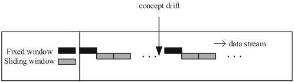
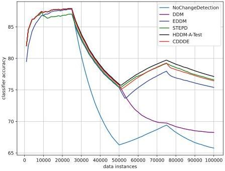

Check for updates

# Unsupervised Online Concept Drift Detection Based on Divergence and EWMA

Qilin Fan, Chunyan Liu, Yunlong Zhao$^{(\text{\textcircled{=}})}$, and Yang Li

Nanjing University of Aeronautics and Astronautics, Nanjing, China
zhaoyunlong@nuaa.edu.cn

Abstract. Concept drift problem is a common challenge for data stream mining, while the underlying distribution of incoming data unpredictably changes over time. The classifier model in data stream mining must be self-adjustable to the concept drift, otherwise it will get terrible classification results. To detect concept drift timely and accurately, this paper proposes an unsupervised online Concept Drift Detection algorithm based on Jensen-Shannon Divergence and EWMA(CDDDE), which detects concept drift through measuring the difference of data distribution within sliding windows and calculating the drift threshold dynamically by Exponentially Weighted Moving Average (EWMA), during the detection without the use of labels. Once concept drift is detected, a new classifier would be trained using the current and subsequent data. Experiments on artificial and real-world datasets show that CDDDE algorithm can efficiently detect the concept drift, and the retrained classifier effectively improves the classification accuracy for the subsequent data. Compared with some supervised algorithms, the detection accuracy and classification accuracy are higher for most datasets.

Keywords: Concept drift · Unsupervised learning · Jensen-shannon divergence · EWMA · Data distribution

# 1 Introduction

Traditionally, the data studied in machine learning tends to be static data, which can be stored in memory and processed for the entire dataset. But in recent years, there has been a tremendous increase of interest in algorithms that can learn from data streams. Data streams are different from traditional data mining methods because of their large volume of data, real-time arrival, and the fact that once the data is processed, it cannot be taken out again for processing, unless it is deliberately saved. Data in the real-world environment may have dynamic behavior, and the concept can change, which is known as the concept drift problem [1]. The concept drift problem was first proposed in [2], where this author modeled a supervised learning task that concept drift occurs due to the environment changes. The definition of concept drift is described as follows. Given a time period $[0, t]$, the data stream in that time period is represented as $S_{0,t} = \{d_0, \cdots, d_t\}$ where

© The Author(s), under exclusive license to Springer Nature Switzerland AG 2023

B. Li et al. (Eds.): APWeb-WAIM 2022, LNCS 13421, pp. 121–134, 2023.

https://doi.org/10.1007/978-3-031-25158-0_10122 Q. Fan et al.

$d_i = (X_i, y_i)$ denotes a data instance in the data stream, $X_i$ is the feature vector, $y_i$ is the label, and the data stream $S_{0,t}$ follows some distribution $F_{0,t}(X, y)$. If it appears that $F_{0,t}(X, y) \neq F_{t+1,\infty}(X, y)$, it means that a concept drift occurs at moment $t+1$, denoted as $\exists t : P_t(X, y) \neq P_{t+1}(X, y)$ [3]. This means that the probability of the same feature vector classification result changes before and after moment $t$.

Concept drift occurs when the concept about which data are being collected shifts from time to time after a minimum stability period. Such changes are reflected in incoming instances and decreases the accuracy of classifiers learned from past training instances. Examples of real life concept drifts including monitoring systems, financial fraud detection, spam categorization, weather predictions, and customer preferences [4].

Changes of target concepts are categorized into abrupt, gradual, incremental and so on, sometimes with noisy data interspersed in the data stream. Different detection algorithms can handle different types of concept drift, some algorithms can handle only a specific type of drift, while others can accommodate multiple drift types.

This paper proposes an unsupervised online concept drift detection algorithm based on Jensen-Shannon divergence and EWMA using knowledge related to information theory. The algorithm firstly divides the data stream into sliding windows and detects the change of Jensen-Shannon divergence of the feature attributes within the windows, and then dynamically calculate the threshold of the change of data distribution between the sliding windows by EWMA, if concept drift is detected there would incrementally train a new classifier to deal with the decrease of classification accuracy. The algorithm detects concept drift without true labels and can be used in an online environment. The experiments show that the algorithm has a high accuracy improvement in dealing with various concept drifts.

This paper is organized as follows. Section 2 we review some outstanding research work dealing with the concept drift in data streams. Section 3 details the concept drift detection algorithm CDDDE. Section 4 explains our experimental setup and analyzes our experimental results. Finally, Sect. 5 presents our conclusions and directions for future work.

## 2 Related Work

In dynamically changing and non-stationary environments, the data distribution changes over time, giving rise to the phenomenon of concept drift, which proposed by Schlimmer and Granger in 1986 [5]. Since its introduction, researchers have proposed many relevant algorithms [6] for the concept drift problem and have achieved many results.

### 2.1 Detection Algorithms Based on Error Rate

According to the literatures over the years it can be seen that error rate based drift detection algorithms are the largest class of algorithms, which focus on tracking the change of online error rate of the classifier in real time. In PACUnsupervised Online Concept Drift Detection 123

learning models, if the sample data are stably distributed, the error rate of the learning algorithm decreases with the input of the data, and when the probability distribution changes, the error rate of the model increases. The DDM algorithm is the first algorithm based on error rate, which sets two thresholds for the error rate, and when the error rate reaches the warning threshold, it indicates the precursor of a change in the probability distribution, and when the error rate reaches the drift threshold, it indicates a change in the probability distribution, and the model would learn with the data after the drift point [2]. The basic idea of the EDDM algorithm is slightly different from the DDM in that it considers the distance between error rates in addition to the error rate variation, which not only detects the abrupt type drift as effectively as the DDM algorithm but also compensates for the deficiency of the DDM in the gradual type drift [7]. The HDDM algorithm proposes a new method to monitor the measurement metrics during the learning process, and it applies some probabilistic inequalities to obtain theoretical guarantees for detecting changes in the distribution [8]. Most of these algorithms are based on supervised learning, which assumes that the labels are available and it is undoubtedly time and resource intensive upfront.

## 2.2 Detection Algorithms Using a Small Number of Labels

The majority of the concept drift detection algorithms rely on the instantaneous availability of true labels for all already classified instances. This is a strong assumption that is rarely fulfilled in practical applications. Kolmogorov-Smirnov test is a hypothesis test to check whether two samples have the same distribution and the test depends on the p-value and significance value of the samples [9]. In [10] it used the Kolmogorov-Smirnov hypothesis test for two samples that vary over time, using a random tree to perform insertion and deletion operations on the data, with no true labels used in the detection and only a limited number of labels used in updating the classification model. However, the method is mostly used for one-dimensional data and cannot be easily extended to multidimensional data [11], and in practical scenarios data streams are not limited to univariate data but may also arrive as multivariate streams. Clustering is an unsupervised machine learning method and in [12] the algorithm uses a sliding window to cluster the data in the window, divides the data into individual clusters and outliers, compares the proportion of clustered instances within adjacent windows and tolerates a certain change in the proportion of clustered instances and a certain number of outlier points, and gives a drift signal when a specified threshold is reached. Confidence voting is also the concept drift detection method based on unsupervised learning, which maintain multiple drift detection trajectories during detection and determine whether concept drift is generated based on changes in confidence voting [13]. Margin density-based methods, which rely on the margin of the classifier to detect concept drift, it calculates the proportion of data instances in the margin and when the margin density exceeds a density threshold would alarm a drift [14]. The use of Chernoff Bound to define the number of instances in data streams that deviate from the mean [15], the key step of this approach is to determine the total amount of124 Q. Fan et al.

instances needed to indicate that the learning algorithm has expired and that a new one should be learned from data [16].

### 2.3 Detection Algorithms Using Divergence

There are some explorations of concept drift detection algorithms based on divergence. Borchani [17] used Kullback-Leibler divergence to calculate the variability of different subsets of the data stream, which suffers from distance asymmetry. Wang [18] used Kullback-Leibler divergence to measure distribution differences, and then, used their own proposed multi-scale drift detection test to check whether the current data concepts are different from the historical concepts. Sun [19] used Jensen-Shannon divergence to measure the distribution difference, but their algorithm uses a fixed threshold to measure the difference resulted in a poor applicability.

## 3 The Proposed Method

In this section, We describe in detail the algorithm proposed in this paper. Firstly describing how to construct the data distribution within the sliding window, then measuring the distribution differences using divergence, and finally calculating the drift threshold using EWMA.

### 3.1 Constructing Data Distribution Functions Based on Sliding Windows

Common concept drift detection algorithms for data streams are per-data-instance-based and block-based, and the algorithm in this paper would follow the second form. Let $x_1, x_2, \cdots$ denote the data stream, where each $x_i$ denotes a data instance and $w = \{x_1, x_2, \cdots, x_n\}$ denotes the data window of $n$ data. We use a double window mechanism [20], where the data in one window is used to construct the initial distribution, which remains relatively fixed and updates it when the concept drift is detected. The other window is used to follow the data stream for sliding, so as to indicate the latest distribution of data in the data stream.

The next to be considered is how to map the multidimensional data within the window to the distribution. we denote the relative proportion $P_w(x)$ of each vector $x$ in $w$

$$P_w(x) = \frac{N(x \mid w)}{n} \quad (1)$$

where $N(x \mid w)$ denotes the number of vectors $x$ in the window and $n$ denotes the number of data in the window. We use data frequency to calculate each attribute within the window, then the combination of the frequencies of each attribute constitutes the empirical distribution function $P_w$ for the current window, and the empirical distribution can be understood as the maximum likelihood estimate of the true distribution. Although it is often infeasible to accurately estimate the probability distribution of concept drift, it helps to design drift detection algorithms [21].Unsupervised Online Concept Drift Detection

125

Fig. 1. Sliding window model

### 3.2 Measuring Differences in Data Distribution Between Windows Using Jensen-Shannon Divergence

We firstly introduce the Kullback-Leibler divergence and then extend to the Jensen-Shannon divergence through its shortcomings in this algorithm. Kullback-Leibler divergence, also called relative entropy, is widely used in the field of information theory. It is a metric often used to quantify the variability between two probability distributions. Denote by X some discrete random variable, and the two probability distributions on the random variable are  \( P(x) \)  and  \( Q(x) \) , respectively, the Kullback-Leibler divergence between them is defined as

\[
K L (P | | Q) = \sum_ {i = 1} ^ {n} P (x) \log \frac {P (x)}{Q (x)} \tag {2}
\]

The smaller the difference between the data distributions, the smaller the value of Kullback-Leibler divergence, which is 0 when the two distributions are identical. The formula for Kullback-Leibler divergence shows that it is not symmetric.

\[
K L (P | | Q) \neq K L (Q | | P) \tag {3}
\]

Therefore, when calculating the data distribution within the window, there may be an abnormal result, so Jensen-Shannon divergence is used in this algorithm. Jensen-Shannon divergence is actually a correction on the asymmetry problem of Kullback-Leibler divergence, and the formula after Jensen-Shannon divergence is expanded is

\[
J S (P | | Q) = \sum_ {i = 1} ^ {n} P (x) \log \frac {2 P (x)}{P (x) + Q (x)} + \sum_ {i = 1} ^ {n} Q (x) \log \frac {2 Q (x)}{P (x) + Q (x)} \tag {4}
\]

It solves the asymmetry problem of Kullback-Leibler divergence and provides a more accurate measure of similarity. With the data distribution which constructed in Sect. 3.1 the differences in data distribution between windows can be measured. One of the methods to calculate the differences in data distribution between windows is using a certain way to divide the feature subspace, and then126 Q. Fan et al.

combine the differences in each feature subspace. The strategy of this paper is calculating the difference of each attribute between windows and then sum them up.

### 3.3 Calculating Concept Drift Threshold Using EWMA

The weighted moving average is a method which gives different weights to the observations separately, calculates the moving average by different weights, and uses the moving average as a basis to determine the forecast value. EWMA (exponentially weighted moving average), is a method in which the weighting coefficient of each value decreases exponentially with time, the closer the value to the current moment the greater the weighting coefficient [22]. Why choose the exponentially weighted moving average is that the recent observations have a greater influence on the forecast value and it can reflect the trend of recent changes, which is a powerful indicator in the concept drift detection.

After the first two steps of the algorithm we are able to obtain the value of Jensen-Shannon divergence between sliding windows, which we use as a statistical indicator. Then the EWMA statistic for the current sliding window is expressed as

$$z_i = \lambda j_i + (1 - \lambda) z_{i-1} \quad (5)$$

where $z_i$ denotes the EWMA value of the i-th sliding window in which no concept drift occurred, $\lambda$ denotes the weight coefficient of EWMA on the historical data, whose value is closer to 1, indicating a lower weight on the historical data, and $j_i$ denotes the Jensen-Shannon divergence between the current window and the fixed window. It is also necessary to recalculate the variance $\sigma_z$ of the EWMA value at each sliding window. $\sigma_{zi}$ denotes the variance of the i-th sliding window, which is calculated as [22]

$$\sigma_{zi}^2 = \sigma^2 \left( \frac{\lambda}{2 - \lambda} \right) \left[ 1 - (1 - \lambda)^{2i} \right] \quad (6)$$

where $\sigma$ denotes the overall variance of the EWMA computed before the current window when no concept drift has occurred. When $i$ gradually increases, $(1 - \lambda)^{2i}$ will soon converge to zero, but when $i$ is small, retaining this part is beneficial to improve the effects of EWMA. With the constant arrival of the data stream, we can then set a variable upper and lower threshold by the calculated value of EWMA and the mean variance. We use UCL and LCL to denote the upper and lower thresholds, respectively, which are calculated as

$$UCL = \mu + L\sigma \sqrt{\left( \frac{\lambda}{2 - \lambda} \right) \left[ 1 - (1 - \lambda)^{2i} \right]} \quad (7)$$

$$LCL = \mu - L\sigma \sqrt{\left( \frac{\lambda}{2 - \lambda} \right) \left[ 1 - (1 - \lambda)^{2i} \right]} \quad (8)$$Unsupervised Online Concept Drift Detection

127

where  \( \mu \)  denotes the average value of the EWMA calculated before the current window when no concept drift occurs, and L as a control limit width factor that can be dynamically adjusted according to the variation of the Jensen-Shannon divergence detected. The adjustment of L can make the algorithm adapt to more drift types and drift datasets which provide higher robustness and applicability.

Algorithm 1. CDDDE concept drift detection algorithm

Input: data stream S, window size n, EWMA history weighting factor  \( \lambda \) , limit width L

Output: Concept drift detection result F

1: for each instance  \( x_{i} \in S \)  do

2: while initial window  \( w_{1} \)  size < n do

3: add  \( x_{i} \)  to  \( w_{1} \) ;

4: end while

5: Calculate probability distribution of  \( w_{1} \)  by (1)

6: while sliding window  \( w_{2} \)  size < n do

7: add  \( x_{i} \)  to  \( w_{2} \) ;

8: end while

9: Calculate probability distribution of  \( w_{2} \)  by (1)

10: Calculate  \( JS(w_{1}||w_{2}) \)  by (4)

11: Calculate  \( z_{i} \)  by (5)

12: Calculate threshold UCL and LCL by EWMA

13: if  \( z_{i} > UCL \)  or  \( z_{i} < LCL \)  then

14: alarm concept drift

15: clear  \( w_{1} \) , clear  \( w_{2} \) 

16: else

17: clear  \( w_{2} \) 

18: end if

19: end for

## 4 Experiments

### 4.1 Datasets

Massive Online Analysis (MOA) is a framework for data stream analysis. It includes many machine learning algorithms and tools for evaluation. This algorithm is developed and implemented based on the MOA framework, and the experiments use artificial datasets and real-world datasets. The basic information of the datasets is shown in Table 1.

Artificial Datasets. The artificial dataset is generated based on the data generation function in MOA.128 Q. Fan et al.

**Table 1.** Basic information of the datasets

|  Name | Number of instances | Number of features | Number of class | Number of drifts | Type of drifts  |
| --- | --- | --- | --- | --- | --- |
|  *Agrawal_{a}* | 100K | 9 | 2 | 3 | Abrupt  |
|  *Agrawal_{g}* | 100K | 9 | 2 | 3 | Gradual  |
|  SEA | 100K | 3 | 2 | 3 | Abrupt  |
|  Hyperplane | 100K | 10 | 2 | - | Incremental  |
|  Airlines | 539K | 7 | 2 | Unknown | Unknown  |
|  Covertype | 581K | 54 | 7 | Unknown | Unknown  |
|  Spambase | 4K | 57 | 2 | Unknown | Unknown  |

*Agrawal Dataset.* It is a dataset that determines whether or not to loan based on information about an individual, and contains both loanable and non-loanable categories. It contains 6 numerical attributes and 3 categorical attributes, and uses ten different predefined loan functions to generate the data. The dataset contains 100K instances, with drift occurring every 25K, and is divided into two types of abrupt and gradual drift, with three drift points set for both types.

*SEA Dataset.* It contains 3 numerical attributes and uses 4 different functions defined to generate the data. The dataset contains 100K instances, with abrupt drift occurring every 25K, and a total of three drift points set.

*Hyperplane Dataset.* It contains 10 numerical attributes, and the data is incrementally drifted by constant small changes in the decision boundary. The dataset contains 100K instances, and the probability of change for each generated instance is 0.001, and its drift type is incremental.

**Real-world Datasets.** In addition to artificial datasets, we also chose some common real-world datasets for concept drift detection to conduct experiments.

*Airlines Dataset.* It contains 3 numerical attributes and 4 categorical attributes. This dataset contains 539383 data and it is a binary classification dataset that determines whether the plane will be delayed based on the condition.

*Covertype Dataset.* It contains 10 numeric attributes and 44 categorical attributes with only 0 and 1 values. The dataset contains 581,012 data and it aims to predict the type of cover of a forest in an area with 7 different class labels.

*Spambase Dataset.* It contains 57 attributes and 4601 instances. The dataset is mainly used for spam identification filtering, where spam resources are obtained from mail administrators and individuals who submit spam, and the dataset is also often used to construct spam filters.Unsupervised Online Concept Drift Detection 129

## 4.2 Experimental Settings

The concept drift detection algorithm in this paper is based on unsupervised learning, and the detection algorithm does not use the labels of the dataset, but for the sake of relevant statistical metrics and comparison experiments, we assume that the labels are immediately available after the detection of concept drift and can be used for the calculation of classifier accuracy. The classifier accuracy will serve as an important evaluation metric for our detection algorithm, since the consequence of concept drift is a dramatic decrease in the classification accuracy of the classifier [23]. In order to evaluate only the impact of the concept drift detection algorithm on the classification accuracy, our experiments are computed using Naïve Bayes for classification, which does not have an automatic adaptation strategy for concept drift, making the drift detection completely dependent on our detection algorithm.

In addition to the classification accuracy we care about the number of detected drift points in the dataset and whether the drift points are incorrectly located, so we use true positive TP to indicate the number of detected drift points as correct drift points, false positive FP to indicate the number of detected drift points as incorrect drift points, and false negative FN to indicate the number of undetected correct drift points, since most algorithms are have a certain delay in detection, so we allow a certain delay in counting TP and include it in the number of TP. Due to the difficulty in estimating these performance measures on incremental datasets and real-world datasets, so we will only count the number of drift points output by the concept drift detection algorithm and the accuracy of the classifier.

The data stream $S$ is read by MOA using the generated and real datasets, the window size $n$ is defaulted to 500. $\lambda$ denotes the EWMA historical weight factor, a larger $\lambda$ makes the algorithm increases the weight of the Jensen-Shannon divergence calculated in the current window, thus decreasing the EWMA statistic calculated in the previous window, and it can be adjusted according to the changes in the datasets, the default value of $\lambda$ is 0.1. $L$ denotes the limit width factor, it is used to adjust the threshold of whether the concept drift is detected or not, a smaller $L$ can be set to detect small changes in the datasets, conversely, a larger $L$ can be set to detect large changes in the datasets and avoid small changes due to noise, the default value of $L$ is 3. The other parameters of the detection algorithm or classifier are adopted as the default values in the MOA framework. The following experimental results are all run under MOA experimental platform.

## 4.3 Results and Analysis

The experiments are evaluated using the Evaluate Prequential strategy in MOA, which means that each instance is used as test data and then used as training data to incrementally train the classifier, thus maximizing the use of each instance and ensuring smooth accuracy.130 Q. Fan et al.

The focus is on the concept drift detection and whether classifier can adapt the new data after changes, so we evaluate the performance of the proposed algorithm by comparing with the algorithm which are integrated in MOA and has high detection efficiency. NoChangeDetection detector is used as a benchmark to demonstrate whether the classification accuracy is affected when the datasets appear concept drift. Besides, we compare it with the concept drift detection algorithm to evaluate the accuracy gain of the detection algorithm on the classifier. Most of these comparative algorithms have been described in related work.

Table 2, Table 3 and Table 4 show the experimental results of comparing our proposed concept drift detection algorithm with common concept drift detection algorithms on artificial datasets where the exact drift points are known. The types of data drift used in these three datasets are abrupt type and gradual type, and it can be seen that our algorithm has good results in determining the detection of concept drift points, and basically there is no leakage and wrong detection, while other algorithms either have leakage or wrong detection values are higher. In terms of the accuracy of the classifier, we can see that the algorithm CDDDE either reaches the highest on the three datasets or has a slight difference compared to the highest accuracy in the comparison algorithms. But the advantage of CDDDE is that it does not require labels and it can be used in an online environment, while other algorithms require a large number of labels during the detection of concept drift.

**Table 2.** The experimental results in *Agrawal*$_{a}$ dataset

|  Detector | TP | FP | FN | Accuracy  |
| --- | --- | --- | --- | --- |
|  NoChangeDetection | 0 | 0 | 3 | 73.93  |
|  DDM | 1 | 0 | 2 | 76.84  |
|  EDDM | 3 | 15 | 0 | 79.52  |
|  STEPD | 3 | 18 | 0 | 80.34  |
|  HDDM-A-Test | 3 | 0 | 0 | **80.89**  |
|  CDDDE | **3** | **0** | **0** | 80.49  |

**Table 3.** The experimental results in *Agrawal*$_{g}$ dataset

|  Detector | TP | FP | FN | Accuracy  |
| --- | --- | --- | --- | --- |
|  NoChangeDetection | 0 | 0 | 3 | 73.81  |
|  DDM | 1 | 1 | 2 | 75.17  |
|  EDDM | 1 | 6 | 2 | 75.2  |
|  STEPD | 3 | 30 | 0 | 76.34  |
|  HDDM-A-Test | 3 | 4 | 0 | 77.25  |
|  CDDDE | **3** | **1** | **0** | **77.61**  |Unsupervised Online Concept Drift Detection

131

Table 4. The experimental results in SEA dataset

|  Detector | TP | FP | FN | Accuracy  |
| --- | --- | --- | --- | --- |
|  NoChangeDetection | 0 | 0 | 3 | 86.47  |
|  DDM | 1 | 2 | 2 | 87.35  |
|  EDDM | 0 | 18 | 3 | 86.55  |
|  STEPD | 3 | 9 | 0 | 87.7  |
|  HDDM-A-Test | 3 | 0 | 0 | 87.87  |
|  CDDDE | 3 | 0 | 0 | 87.84  |

In order to show the comparison results of each algorithm more visually, we export the real-time accuracy changes calculated in  \( Agrawal_{a} \)  dataset in MOA and visualize them. As shown in Fig. 2, since we set drift points at 25K, 50K, and 75K of the dataset, we can see that the accuracy of the classifier drops sharply without concept drift detection, but with the concept drift detection algorithm we can see that our algorithm can detect concept drift accurately and adapt immediately as most concept drift detection algorithms. Similar to the  \( Agrawal_{a} \)  dataset, the other datasets used for experiment are also able to identify the drift points well and improve the adaptation of the classifier.

Fig. 2. Comparison of real-time classification accuracy in the  \( Agrawal_{a} \)  dataset132 Q. Fan et al.

Table 5 show the results on the incremental drift and the real-world datasets, both of them are commonly used for concept drift detection. Due to the difficulty in estimating those performance measures which on artificial datasets, we only count the number of drift points output by the concept drift detection algorithm and the accuracy of the classifier. It can be seen that our algorithm is effective in detecting concept drift, and the output of the number of drift points is much smaller than other algorithms. It may allow our algorithm to detect critical variation points and make adjustments, so that other parts related to the detection algorithm will not have to change too often in order to reduce the impact of concept drift.

**Table 5.** The experimental results in Hyperplane, Airlines, Covertype and Spambase

|  Detector |  | NoChange-Detection | DDM | EDDM | STEPD | HDDM-A-Test | CDDDE  |
| --- | --- | --- | --- | --- | --- | --- | --- |
|  Hyperplane | Num | 0 | 10 | 44 | 24 | 10 | 12  |
|   |  Accuracy | 77.13 | 81.5 | 83.91 | 85.42 | 84.64 | 85.06  |
|  Airlines | Num | 0 | 13 | 23 | 644 | 72 | 30  |
|   |  Accuracy | 66.99 | 67.71 | 67.17 | 66.75 | 68.23 | 67.9  |
|  Covertype | Num | 0 | 4634 | 2416 | 3731 | 3284 | 166  |
|   |  Accuracy | 66.98 | 86.62 | 85.03 | 86.88 | 86.6 | 80.75  |
|  Spambase | Num | 0 | 1 | 2 | 47 | 1 | 2  |
|   |  Accuracy | 90.15 | 97.42 | 97.18 | 97.68 | 97.53 | 96.46  |

## 5 Conclusion

The concept drift detection is one of the key issues in data stream mining, and if the concept drift cannot be detected timely, there would result in a sharp decrease in the accuracy of the classifier. This paper proposes a method for concept drift detection and classifier adjustment, which can efficiently detect various types of concept drift and update the classifier at the drift point timely. The detection algorithm does not need the classification labels of the data stream in advance, and it reduces detection cost significantly. Particularly, this method can be used as a framework combined with other detection algorithms to enhance the concept drift detection. As the following work, we will pay our attention to the concept drift detection algorithms combined with ensemble classifier to achieve a higher classification accuracy.

**Acknowledgements.** This research was supported by National Natural Science Foundation of China under Grant No. 62072236.Unsupervised Online Concept Drift Detection 133

## References

1. Iwashita, A.S., Papa, J.P.: An Overview on Concept Drift Learning. IEEE Access 7, 1532–1547 (2019)
2. Gama, J., Medas, P., Castillo, G., Rodrigues, P.: Learning with Drift Detection. In: Bazzan, A.L.C., Labidi, S. (eds.) SBIA 2004. LNCS (LNAI), vol. 3171, pp. 286–295. Springer, Heidelberg (2004). https://doi.org/10.1007/978-3-540-28645-5_29
3. Lu, J., Liu, A. Dong, F., Gu, F., Gama, J., Zhang, G.: Learning under Concept Drift: a Review. IEEE Trans. Knowl. Data Eng. 31, pp. 2346–2363 (2019)
4. Dongre P.B., Malik L.G.: A review on real time data stream classification and adapting to various concept drift scenarios. IEEE International Advance Computing Conference (IACC), pp. 533–537 (2014)
5. Gama, J., Žliobaitė, I., Bifet, A., Pechenizkiy, M., Bouchachia, A.: A survey on concept drift adaptation. ACM Comput. Surv. 46(4), 1–37 (2014)
6. Patil, M.M.: Handling Concept Drift in Data Streams by Using Drift Detection Methods. In: Balas, V.E., Sharma, N., Chakrabarti, A. (eds.) Data Management, Analytics and Innovation. AISC, vol. 839, pp. 155–166. Springer, Singapore (2019). https://doi.org/10.1007/978-981-13-1274-8_12
7. Baena-Garcia M, del Campo-Ávila J, Fidalgo R, et al.: Early drift detection method. In: Fourth International Workshop on Knowledge Discovery from Data Streams, pp. 77–86. (2006)
8. Frias-Blanco, I., del Campo-Avila, J., Ramos-Jimenez, G., Morales-Bueno, R., Ortiz-Diaz, A., Caballero-Mota, Y.: Online and Non-Parametric drift detection methods based on Hoeffding’s bounds. IEEE Trans. Knowl. Data Eng. 27(3), 810–823 (2015)
9. Wang, Z., Wang, W.: Concept Drift Detection Based on Kolmogorov-Smirnov Test. In: Liang, Q., Wang, W., Mu, J., Liu, X., Na, Z., Chen, B. (eds.) Artificial Intelligence in China. LNEE, vol. 572, pp. 273–280. Springer, Singapore (2020). https://doi.org/10.1007/978-981-15-0187-6_31
10. Dos Reis, D. M., Flach, P., Matwin, S., Batista, G.: Fast Unsupervised Online Drift Detection Using Incremental Kolmogorov-Smirnov Test. In: Proceedings of the 22nd ACM SIGKDD International Conference on Knowledge Discovery and Data Mining, pp. 1545–1554. Association for Computing Machinery, San Francisco, California, USA (2016)
11. Lu, N., Zhang, G., Lu, J.: Concept drift detection via competence models. Artif. Intell. 209, 11–28 (2014)
12. Chen, H.-L., Chen, M.-S., Lin, S.-C.: Catching the Trend: A Framework for Clustering Concept-Drifting Categorical Data. IEEE Trans. Knowl. Data Eng. 21(5), 652–665 (2009)
13. D’Ettorre, S., Viktor, H.L., Paquet, E.: Context-Based Abrupt Change Detection and Adaptation for Categorical Data Streams. In: Yamamoto, A., Kida, T., Uno, T., Kuboyama, T. (eds.) DS 2017. LNCS (LNAI), vol. 10558, pp. 3–17. Springer, Cham (2017). https://doi.org/10.1007/978-3-319-67786-6_1
14. Sethi, T.S., Kantardzic, M.: Don’t Pay for Validation: Detecting Drifts from Unlabeled data Using Margin Density. Procedia Comput. Sci. 53, 103–112 (2015)
15. Diaz-Rozo, J., Bielza, C., Larrañaga, P.: Clustering of Data Streams With Dynamic Gaussian Mixture Models: an IoT Application in Industrial Processes. In: IEEE Internet of Things Journal 5(5), pp. 3533–3547 (2018)
16. Ghani, N. L. A., Aziz, I. A., Mehat, M.: Concept Drift Detection on Unlabeled Data Streams: a Systematic Literature Review. In: 2020 IEEE Conference on Big Data and Analytics (ICBDA), pp. 61–65 (2020)134 Q. Fan et al.

17. Hanen, B., Pedro, L., Concha, B.: Classifying Evolving Data Streams with Partially Labeled Data. Intell. Data Anal. 15(5), 655–670 (2011)
18. Wang, X., Kang, Q., An, J., Zhou, M.: Drifted Twitter Spam Classification Using Multiscale Detection Test on K-L Divergence. IEEE Access 7, pp. 108384–108394 (2019)
19. Yange, S., et al.: Adaptive ensemble classification algorithm for data streams based on information entropy J. Univ. Sci. Technol. Chin. 47(7), 575–582 (2017)
20. Guo, H., Li, H., Ren, Q., Wang, W.: Concept drift type identification based on multi-sliding windows: Husheng Guo, Hai Li, Qiaoyan Ren, Wenjian Wang. Inf. Sci. 585, 1–23 (2022)
21. Webb, G.I., Hyde, R., Cao, H., Nguyen, H.L., Petitjean, F.: Characterizing concept drift. Data Min. Knowl. Disc. 30(4), 964–994 (2016). https://doi.org/10.1007/s10618-015-0448-4
22. Ross, G.J., Adams, N.M., Tasoulis, D.K., Hand, D.J.: Exponentially weighted moving average charts for detecting concept drift. Pattern Recogn. Lett. 33(2), 191–198 (2012)
23. Khamassi, I., Sayed-Mouchaweh, M., Hammami, M., Ghédira, K.: Discussion and review on evolving data streams and concept drift adapting. Evol. Syst. 9(1), 1–23 (2016). https://doi.org/10.1007/s12530-016-9168-2